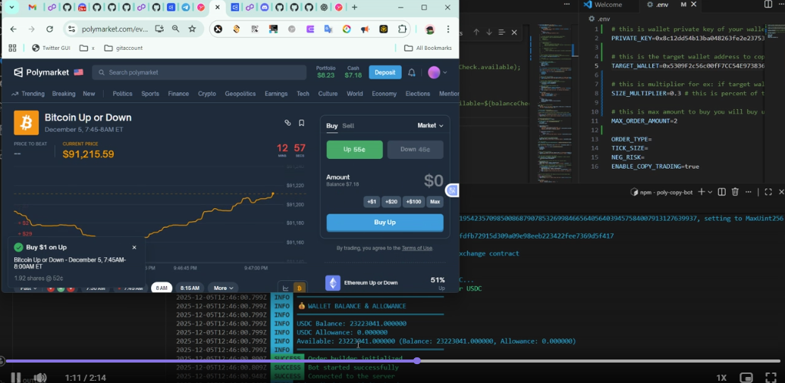
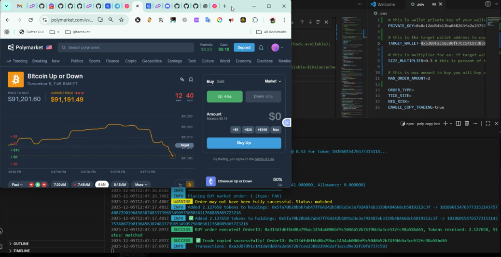

# Polymarket TypeScript Trading Bot

# [Telegram: blategold](https://t.me/blategold) lets connect.
A professional TypeScript-based trading bot for Polymarket with full credential management, order execution, market analysis, and **automated arbitrage trading** capabilities.

## Features 
you can see my proof of work. Copy trading is available. lets contact. this is the wallet in video.
https://polygonscan.com/address/0x5309F2c56c00fF7CC54E973836756A0c7F2731F9#tokentxns

then if you want you can give me tip here. my wallet: 0x5309F2c56c00fF7CC54E973836756A0c7F2731F9

# Polymarket Copy Trading Bot
Automatically mirrors trades on Polymarket in real-time. Built for DeFi enthusiasts who want to copy profitable trades efficiently.
<meta name="description" content="Polymarket copy trading bot for DeFi markets. Real-time trade mirroring, multi-wallet support, and analytics dashboard.">

## Features
- Real-time copy trading
- Multi-wallet support
- Supports Polymarket markets

## Demo Images

Click the images below to watch the video:

---

## Contact

If you want to get in touch, contact me on Telegram:  

⭐ Star this repo if you find it useful!
